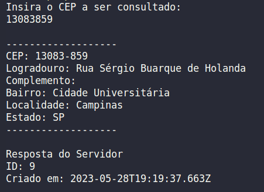

# Consulta de CEP
HandsOn - Atividade Extra do curso Tecnologias Microsoft 
Objetivo didático: Consumo de serviços em C#  
 
A atividade consiste em criar uma REST API de Consulta de CEP  
Foram implementados os seguintes métodos:
  - GET para a consulta de CEP no serviço [ViaCEP](https://viacep.com.br/)
  - POST para armazenar a consulta em um [banco de dados mockado](https://mockapi.io/)
-----
 

<strong>Execução da consulta</strong>

